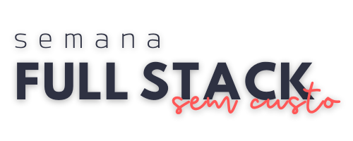

# Bem vindo à Semana Full Stack Sem Custo, da Codar.me!



Entre os dias 5 e 9 de abril, vamos desenvolver uma aplicação completa: front, back e banco de dados, totalmente escalável, sem se preocupar com servidor, nem gastar 1 centavo com infra!

[Cadastre-se](http://codar.me/webinario) para não perder nenhuma aula!

Ficou com dúvidas ou teve algum problema? Manda lá no [canal da semana no discord](https://discord.gg/Pdr3kVHF) pra galera te ajudar!
## O Projeto

Durante estas aulas, desenvolveremos uma aplicação de agendamento de horários chamada Clocker, utilizando React com NextJS e Firebase para autenticação e banco de dados.

**Para rodar o projeto:**

```bash
npm run dev
# or
yarn dev
```

Abra [http://localhost:3000](http://localhost:3000) no seu navegador e veja o resultado!

## Material de apoio

- [Figma (layout do projeto)](https://www.figma.com/file/OlPhiP13rGlapw5OOuQDOV/Clocker?node-id=0%3A1)

## E as redes sociais, já tá seguindo?

📸 [Instagram](http://bit.ly/2Xr94S2)
👨🏻‍💻 [Facebook](http://bit.ly/2KqIrar​​)


📬  No [canal do Telegram](https://bit.ly/2AcRz0e​​), temos conteúdos conteúdos exclusivos!